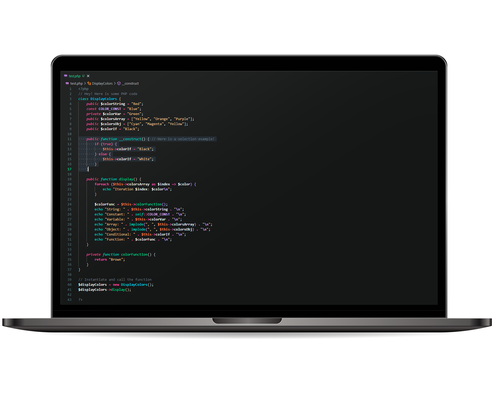

# Bersk Dark Theme for Visual Studio Code

## Overview
(EN) Bersk Dark Theme is a customized color scheme for Visual Studio Code, designed to enhance your coding experience with a sleek and modern aesthetic. Inspired by the popular Monokai theme, Bersk Dark brings unique color tweaks that reflect Bersk's personal preferences (me, Gustavo J. Baierski).

(PT) Bersk Dark Theme é um esquema de cores personalizado para o Visual Studio Code, projetado para aprimorar sua experiência de codificação com uma estética elegante e moderna. Inspirado no popular tema Monokai, o Bersk Dark traz ajustes de cores exclusivos que refletem as preferências pessoais de Bersk (eu, Gustavo J. Baierski).

## Features (EN)
- **Chill Design**: Enjoy a visually pleasing coding environment with carefully selected colors.
- **Super Cool**: Be 1000% more awesome with this color scheme.
- **Brain Boost**: Programming becomes 981283790% easier with this color scheme (trust me!)

## Features (PT)
- **Design Elegante**: Desfrute de um ambiente de codificação visualmente agradável com cores cuidadosamente selecionadas.
- **Super Legal**: Seja 1000% mais incrível com esse esquema de cores.
- **Boost Cerebral**: Programar se torna 981283790% mais fácil com esse esquema de cores (confia!)

## Screenshots

### Colors Example

### Vue Example

### PHP Example

### C# Example

### Latest Update (EN)

The latest update addressed some issues:

- When using `CTRL + F` to search for comments in the code, the comment text was not readable due to color adjustments.
- Selected text in the Source Control input was not visible; contrast was slightly improved.
- Comments are now slightly lighter for easier readability.
- File selection in the sidebar menu previously had a very light color, which has been adjusted to be slightly darker.

### Última Atualização (PT)

A última atualização abordou alguns problemas:

- Ao usar `CTRL + F` para buscar comentários no código, o texto do comentário não era legível devido a ajustes de cor.
- O texto selecionado no input da aba Source Control não era visível; o contraste foi levemente melhorado.
- Os comentários agora estão um pouco mais claros para facilitar a leitura.
- A seleção de arquivos no menu lateral anteriormente tinha uma cor muito clara, que foi ajustada para ficar ligeiramente mais escura.

## Installation
You can install the Bersk Dark Theme directly from the [Visual Studio Code Marketplace](https://marketplace.visualstudio.com/items?itemName=Bersk.bersk&ssr=false#overview). Don't forget to leave a review if you enjoy using the theme!
